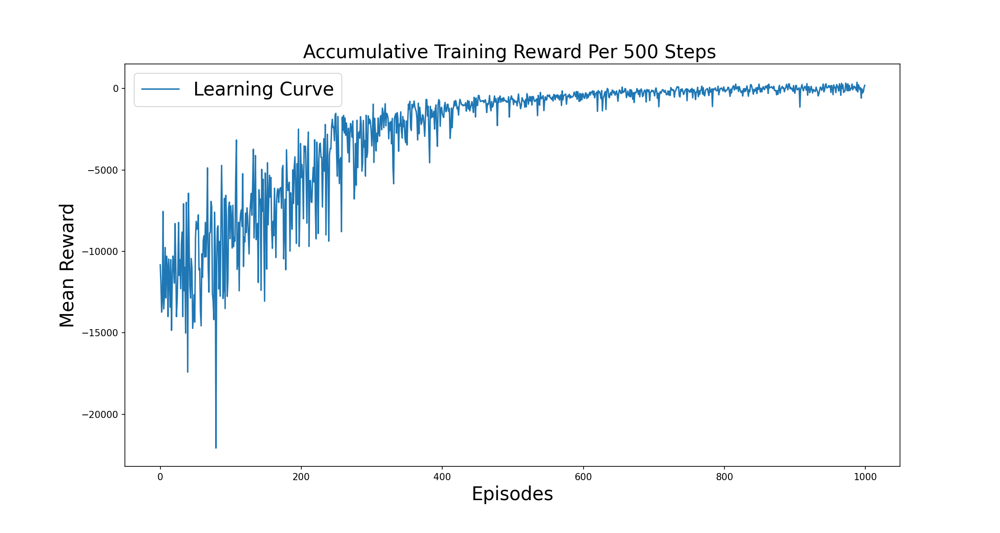
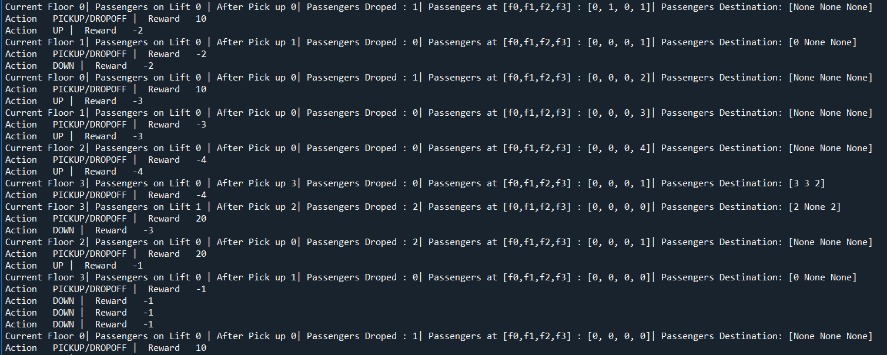
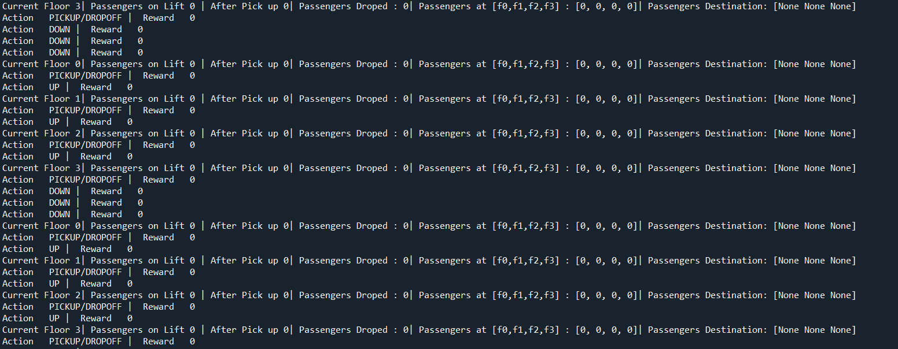
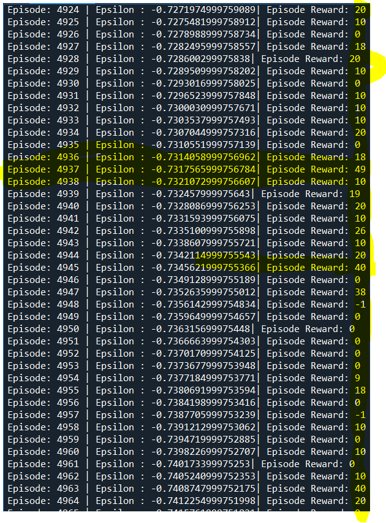

# Q-Learning Lift Problem Solution

## Problem Overview

This repository contains a Q-learning implementation to solve the lift (elevator) system problem. The goal is to train an agent to efficiently operate an elevator by making decisions on when to move, wait, and pick up or drop off passengers in a multi-floor building. The system involves passengers arriving randomly at different floors, and the lift must learn to pick them up and drop them off at their desired destinations while minimizing unnecessary movements and waiting.

## Project Files

- **`environment_design.py`**: Contains the environment logic, including the state space, action space, and reward structure.
- **`agent_design.py`**: Contains the Q-learning agent's implementation, including the training loop.
- **`Q_Table.npy`**: The Q-table containing the learned values for state-action pairs.
- **`Reward_Data.npy`**: The cumulative reward data during training.
- **`learning_Curve.png`**: Plot of the cumulative reward over episodes.
- **`drop_pick_policy.PNG`**: Visualization of the optimal drop-off and pick-up policy.
- **`Q_2.PNG`**: Visualization of the Q-values for state-action pairs.
- **`reward.PNG`**: A plot showing the reward distribution during the training.

---

## Detailed Explanation

### 1. **Environment Class (Lift Problem)**

The environment is designed to simulate the lift's operation. It includes the following components:

#### **State Representation:**

The state is represented as a string combining several key variables:
- `self.current_floor`: The lift’s current floor.
- `self.next_floor`: The next floor the lift is going to.
- `self.psngr_drop_floor`: The destination floors for passengers that are in the lift.
  
For example, the state could look like this:  
`state = str(self.current_floor) + str(self.next_floor) + str(self.psngr_drop_floor[0]) + str(self.psngr_drop_floor[1]) + str(self.psngr_drop_floor[2])`

#### **Action Space:**

The agent can take the following actions:
1. `"UP"`: Move the lift one floor up.
2. `"DOWN"`: Move the lift one floor down.
3. `"WAIT"`: Keep the lift at the current floor.
4. `"PICKUP/DROPOFF"`: Pick up passengers at the current floor and drop off passengers whose destination is the current floor.

#### **Reward Structure:**

The reward is structured as follows:
- **For each dropped-off passenger**: A reward of +10 is given.
- **For each non-productive action (like waiting or moving without a passenger drop)**: A penalty of -1 is applied.

#### **Mathematics (Reward Calculation):**

- **For dropped-off passengers**: 
  The reward is calculated as **10 times the number of passengers dropped off**. This means that for each passenger successfully dropped off at their desired floor, the agent earns 10 points.
  
- **For non-productive actions** (waiting or moving without dropping off passengers):
  The penalty is calculated as **negative one times the sum of the passengers currently in the lift and the total number of passengers waiting at all floors**. This penalty is meant to discourage the agent from performing unnecessary actions like waiting or moving without dropping off passengers.

---

### 2. **Training Loop (Q-learning Agent)**

The Q-learning agent follows these steps to learn the optimal policy:

#### **Initialization:**

- The Q-table is initialized with zeros for all state-action pairs.
- The agent starts with an epsilon (denoted as \( \epsilon \)) of 1.0, meaning it will initially take random actions to explore the environment. Over time, epsilon decays, and the agent increasingly exploits the best-known actions.
  
#### **For Each Episode:**

1. **State Reset**: 
   The environment is reset to a random state.

2. **Action Selection (Epsilon-Greedy Policy):**
   The agent selects an action based on the epsilon-greedy policy:
   - With probability \( \epsilon \), it takes a random action (exploration).
   - With probability \( 1 - \epsilon \), it takes the action that maximizes the Q-value (exploitation).

3. **Action Execution**:
   The chosen action is applied to the environment. The agent receives a reward and the next state is determined.

4. **Q-value Update (Temporal Difference):**
   The Q-value for the current state-action pair is updated using the Temporal Difference (TD) learning formula:
   - **Current Q-value**: The value of the current state-action pair before the update.
   - **Target Q-value**: The expected future reward, calculated by taking the immediate reward from the current action and adding the maximum Q-value of the next state. 
   
   The Q-value update formula is:
   - **If the episode is not done (ongoing)**: The Q-value is updated by adding the difference between the current Q-value and the target Q-value, weighted by the learning rate.
     - **Target Q-value**: The reward from the current action, plus the discount factor multiplied by the maximum Q-value for the next state.
   - **If the episode is done**: The Q-value is updated to be the immediate reward for reaching the terminal state.

   **Mathematical Formula for Q-value Update**:
   - **Current Q-value**: The value of the action at the current state.
   - **Target Q-value**: The sum of the immediate reward and the future reward from the next state.
   
   The formula for updating the Q-value is:
   - **Q-value Update**: 
     - Current Q-value = Current Q-value + Learning Rate × (Target Q-value − Current Q-value)
     - **Target Q-value**:
       - If not done: Reward + Gamma × Max Q-value of the next state
       - If done: Just the reward.

5. **Epsilon Decay**:
   After each action, epsilon is decayed to decrease exploration over time, allowing the agent to exploit what it has learned. The decay is controlled by a decay rate:
   - **Epsilon Decay**: Epsilon is decreased by a fixed decay rate after each step, making the agent less likely to take random actions as it learns.

6. **Reward Tracking**: 
   The cumulative reward for each episode is tracked and saved in `Reward_Data.npy`.

---

## Results

### **Learning Curve**

Below is the plot of the cumulative reward during the training process, showing how the agent's performance improves over time. The curve tracks how the agent's rewards accumulate as it learns to efficiently pick up and drop off passengers.



### **Optimal Policy**

This plot shows the optimal pick-up and drop-off policy learned by the agent. The policy indicates the best actions for the agent to take based on the current state.



### **Q-Values**

This image shows the Q-values associated with different state-action pairs. The values represent the expected cumulative reward for each state-action pair, which the agent uses to make decisions.



### **Reward Distribution**

This image illustrates the reward distribution during training, showing how the agent's actions resulted in different reward values over the episodes.



---

## How to Run the Code

1. Clone this repository.
2. Install the required dependencies:
   ```bash
   pip install numpy matplotlib
